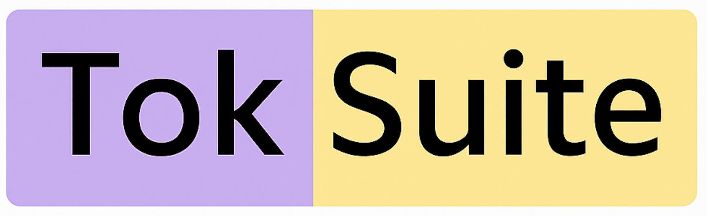
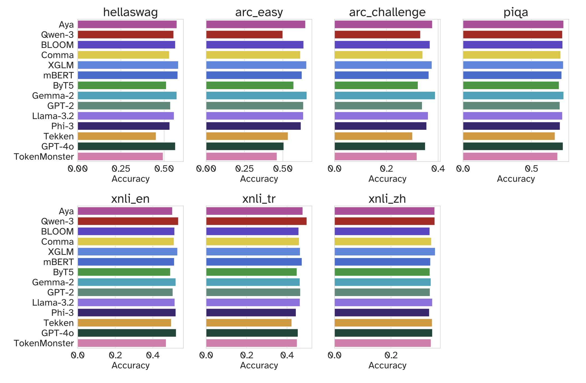

<p align="left">
  
</p>

# TokSuite – {{TOKENIZER_NAME}}

## Model Summary

**TokSuite–{{TOKENIZER_NAME}}** is part of **TokSuite**, a suite of language models designed to study the impact of **tokenizer choice on language model behavior** under controlled conditions.

This model uses the **{{TOKENIZER_NAME}} tokenizer** and is otherwise **identical** to the other TokSuite models in architecture, training data, training budget, and initialization.  
The TokSuite setup ensures that any observed behavioral characteristics reflect properties of the tokenizer rather than differences in model scale, data composition, or optimization.

---

## Tokenizer

- **Tokenizer:** {{TOKENIZER_NAME}}
- **Tokenization method:** {{TOKENIZATION_METHOD}}
- **Vocabulary size:** {{VOCAB_SIZE}}
- **Out-of-vocabulary handling:** {{OOV_HANDLING}}
- **Language coverage:** {{LANGUAGE_COVERAGE}}
- **Pretokenization source:** {{PRETOKENIZATION_SOURCE}}

**Processing details:**
- **Numbers:** {{NUMBER_HANDLING}}
- **Contractions:** {{CONTRACTION_HANDLING}}
- **Unicode normalization:** {{UNICODE_NORMALIZATION}}
- **Whitespace / boundary markers:** {{WHITESPACE_HANDLING}}
- **Zerowidth characters:** {{ZEROWIDTH_HANDLING}}

---

## Why {{TOKENIZER_NAME}}?

{{TOKENIZER_NAME}} was included in TokSuite to represent **{{TOKENIZER_RATIONALE_SHORT}}**.

As described in the tokenizer selection rationale of the TokSuite paper, {{TOKENIZER_NAME}} exemplifies a design point where {{TOKENIZER_DESIGN_AXIS}}.

Including {{TOKENIZER_NAME}} enables TokSuite to study tokenizer behavior in settings where:
- {{RATIONALE_BULLET_1}}
- {{RATIONALE_BULLET_2}}
- {{RATIONALE_BULLET_3}}

This makes {{TOKENIZER_NAME}} a representative example of **{{TOKENIZER_CLASS}}** tokenization.

---

## Model Architecture

- **Architecture:** Decoder-only Transformer (Lingua’s Llama-3.2-1B configuration)
- **Non-embedding parameters:** ~1B
- **Context length:** 4096 tokens
- **Framework:** Meta Lingua
- **Initialization:** Shared super-vocabulary initialization across TokSuite models

The architecture and training setup are identical across all TokSuite models; **only the tokenizer differs**.

---

## Training Data

The model was trained on a **multilingual corpus totaling approximately 100B tokens**, composed of:

- **English:** 40B tokens from *FineWeb-Edu*
- **Multilingual:** 60B tokens evenly distributed across:
  - Chinese (ZH)
  - Turkish (TR)
  - Italian (IT)
  - Farsi (FA)

Pretraining dataset:  
👉 https://huggingface.co/datasets/toksuite/toksuite_pretraining_data

All TokSuite models are trained using a **fixed token budget**, ensuring comparability across tokenizers.

---

## Training Procedure

- **Training steps:** 100,000
- **Sequence length:** 4096
- **Batch size:** 256 sequences
- **Optimizer:** AdamW
- **Peak learning rate:** 1e-3
- **Learning rate schedule:** Cosine decay with 2,000 warm-up steps
- **Weight decay:** 0.1

---

## Evaluation

### Canonical Benchmarks

The model was evaluated on standard base language model benchmarks:

- HellaSwag  
- ARC  
- PIQA  
- XNLI  

<p align="left">
  
</p>

These evaluations verify that the model exhibits reasonable base language modeling behavior at its scale and training budget.

---

### TokSuite Robustness Benchmark

TokSuite–{{TOKENIZER_NAME}} is evaluated on the **TokSuite robustness benchmark**, which measures sensitivity to real-world text perturbations, including:

- orthographic and spelling variations,
- diacritics presence and absence,
- keyboard and input-method noise,
- Unicode formatting and homoglyphs,
- OCR and spacing artifacts,
- LaTeX and STEM-style formatting.

**Metric:**  
Relative performance drop  
\[
(\mathrm{Acc}_{\text{clean}} - \mathrm{Acc}_{\text{perturbed}}) / \mathrm{Acc}_{\text{clean}}
\]
Lower values indicate greater robustness.

**Perturbation categories:**
- **Input:** non-native keyboard input and romanization  
- **Diacr.:** optional diacritics  
- **Orth. & Gram.:** orthographic and grammatical errors  
- **Morph:** morphological variants  
- **Noise:** homoglyphs, OCR artifacts, typos  
- **LaTeX:** mathematical formatting  
- **STEM:** scientific notation  
- **Unic.:** Unicode styling characters  

*NEN* denotes non-English inputs and *EN* denotes English inputs.

> See the TokSuite paper for full cross-tokenizer comparisons.

---

## Intended Use

This model is intended for:
- research on tokenization and robustness,
- multilingual NLP analysis,
- controlled ablation studies,
- benchmarking tokenizer behavior under noise.

It is **not** instruction-tuned, aligned, or optimized for deployment.

---

## Limitations

- Trained on a limited set of five languages.
- Not optimized for instruction following or dialogue.
- Fixed token budget constrains exposure to raw text depending on tokenization efficiency.
- Intended strictly for research purposes.

---

## Ethical Considerations

TokSuite models are released to support **scientific investigation of tokenization effects**.  
They may reflect biases present in large-scale web data and should not be used in high-stakes or user-facing applications without additional safeguards.

---

## Citation

If you use this model, please cite:

```bibtex
@article{toksuite2025,
  title={TokSuite: Measuring the Impact of Tokenizer Choice on Language Model Behavior},
  author={Altıntaş, Gul Sena and Ehghaghi, Malikeh and Lester, Brian and Liu, Fengyuan and Zhao, Wanru and Ciccone, Marco and Raffel, Colin},
  year={2025}
}
